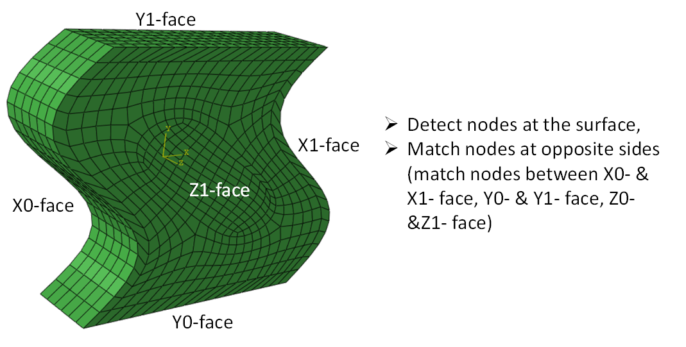
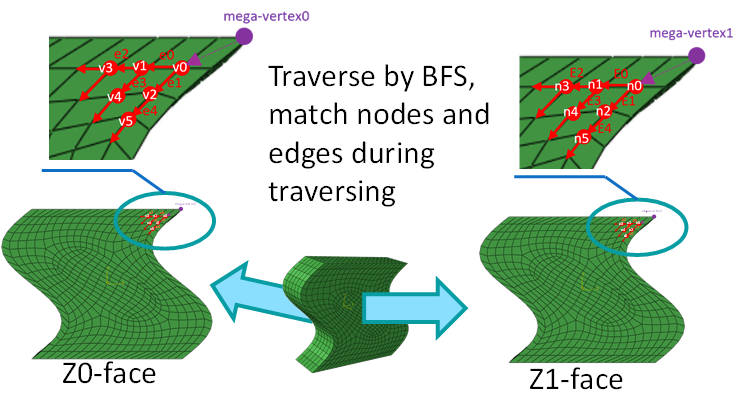
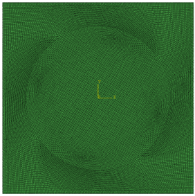

# magicPBC

This project can automatically generate **periodic boundary conditions** (PBCs) more robustly and much quicker. It can deal with **non-rectangle (non-cuboid) shape**, and **enormously accelerate node-matching** process. It fits well for .inp file-format in Abaqus at present, and can be modified to fit other softwares or output data with your specific demands in the later versions. If you apply this project to you papers or your codes, please cite our website: [https://github.com/mo-hanxuan/MagicPBC](https://github.com/mo-hanxuan/MagicPBC), thanks for your supports. 

> Fig. 1 periodic boundary condition (PBC) acts on opposite sides of surface

## why you need magicPBC?

### generate PBC automatically 

​	Given info of node-coordinates (vertexes) and elements (node-indexes of each element), magicPBC can automatically generate periodic boundary conditions (PBC) for you with 2 advantages:

> 1. more robust to deduce surface-info by topology
> 1. much quicker to match nodes on opposite sides of surface

### deduce surface-info by topology (more robust)

​    Here the surface-info includes the surface-nodes and the classification of surface-nodes into 3 pairs of opposite-faces (e.g., the face pairs of left and right, up and down, back and front, respectively).

​    Detecting surface nodes simply by coordinates is a naive method utilized by almost all traditional PBC-generating nodes. For examples, nodes with coordinates of  min-x, max-x, min-y, max-y, min-z, max-z are identified as left-, right-, down-, up-, back-, front- surfaces respectively. 

​	However, this tradition method has many limitations. It can only deal with cuboid shape, and the initial cuboid can not be rotated or deformed, otherwise this method would fail. For example, if there is a non-cuboid hexahedron (as shown Fig. 1), the 6 outer facets (left-, right-, down-, up-, back-, front- surfaces) doesn't determined by the coordinates of min-x, max-x, min-y, max-y, min-z, max-z. If there is a rotation, the coordinates-method also breaks down by the similar way. 

​	But the surface is obviously there, so there must be a better way to detect the surface-nodes and classify them into left-, right-, down-, up-, back-, front- surfaces respectively.

​	Here we introduce a new way to **deduce the surface-info by topology**:

1.  element-facet shared by only one element is identified as surface-facet. Implemented by dictionary-data-structure:
   + key: sorted tuple of facet-nodes (sorted by order of either clockwise or counter-clockwise), 
   + value: list of elements who share this facet
2. element-edge shared by only one element is identified as  outline (dictionary-data-structure)
3. construct the surface-graph (linking of surface-nodes). dictionary-data-structure:
   + key: node-number
   + value: numbers of neighbor-nodes
4. utilize outline as boundary to break some connections of surface-graph,  partition it into 6 connected-domains (left(X0), right(X1), up(Y1), down(Y0), front(Z1) and back(Z0) faces respectively as shown in Fig. 1). Implemented by:
   + union-find algorithm: partition the surface-graph into connected-domains

### matching nodes on opposite sides by BFS  (much quicker)

​	The traditional method matches nodes on opposite sides (of surface) by nearest-coordinates, which is very slow with time-complexity of ), where V is total number of vertexes (nodes). This is  because for each node one side, it has to search all nodes on the other side to find out the matching node. 

​	Here, we present a new method by breadth-first-search (BFS) to match the irregular nodes on opposite sides, with time-complexity of O(V + E) ≈ ), where V and E are the total numbers of nodes and edges on one side of the surface (For a graph simply composed of triangles or quads, E and N is almost the same, thus O(V + E) ≈ )). 

​	Thus, comparing ) with ), our new method can save a lot of time! Especially when there are almost 100 x 100 =  nodes on a surface, our method can provide up to  times of speeding-up. 

​	The basic idea of this method is illustrated as the figure below:

#### 

>  Fig. 2 matching nodes on two opposite faces during traversing the surface-graph by BFS. 
>
> For a matched node-pair (e.g., v0 and n0 on Z0- and Z1- faces respectively), we search the neighbors of them respectively, construct vectors pointed from this node to its neighbors, find the most similar vector-pair to match next pair of nodes (e.g., vector E0 is most similar to e0 among other vectors pointed to neighbors, thus we match v1 and n1 as they are the end points of vector e0 and E0). 

​	For a 3D object with many nodes () on a surface (as shown by the figure below), the performance of our method is compared with the traditional method. 

> Fig. 3 if there are up to 100 x 100 =  nodes on a face, the matching can be a lot faster by BFS traversing (since time complexity is reduced from ) to O(V + E) ≈ ))

## Installation

Just download the zip file, or pull from this website.

+ requirement: before you get started, install Anaconda and PyTorch. Then use anaconda's Python interpreter to run this project. 

## Quick start

Open command line: 

Here are some instructions for the command line:

`python xxxpath/getPeriodicBoundaryCondition.py`

Then insert the .inp file that you want to deal with, (include the path and the file name together, where node-coordinates and elements' node-numbers are recorded in this file with .inp format). For example, here we insert this file in `./tests` folder (corresponding to the object shown in Fig. 1):

`please insert the .inp file name (include the path):` ./tests/irregular_3Dmesh_wave.inp

Choose a method to detect and partition the surface-nodes. Two methods are provided, 

`which method do you want to use?        
1: graph-method (recomended); 
2: xMin, xMax, yMin, yMax, zMin, zMax;  
(insert 1 or 2): ` 1 \n

> 1. graph-method: (recommended, can deal with arbitrary deformed shape) use dictionary-data-structure to map facet-nodes to element-number, where the surface-facet is shared by only one element. Construct the node-linking graph of surface, and the node-linking graph of the outlines. Using outlines as boundaries, partition the graph into different faces (left-, right-, down-, up-, back-, front- surfaces) by union-find algorithm. 
> 2. method of xMin, xMax, yMin, yMax, zMin, zMax: detect the surface simply by coordinates of all nodes. This method can only be applied to the object with cuboid shape.  

Then choose a method to match nodes on opposites of the surface, 

` which method do you want to use to match nodes between two faces? 
    1: breadth-first-search (traverse the nodes by simular path)
    2: nearest-coordinates (could be very slow if there are so many nodes in a face)
insert 1 or 2:`  1 \n

> 1. BFS method to match the nodes as shown in Fig. 2. 
>    1. noted: if the node-graphs are initially different on the opposite sides (based on the initial mesh), the traversing vectors (pointed from current node to neighbor nodes) on two sides could have significant differences. Don't worry, you can choose to continue and reset the error-tolerance following the instructions on the command line. The matching can still be achieved, unless the initial mesh quality is so bad that nodes-alignments are totally different on the opposite sites of surface. 
> 2. nearest-coordinates method to match nodes. Could be very slow (with time complexity of )) when there are many many nodes on a surface. 

Then instruct whether you want to write the result file:

`ok to write the .inp file with PBC inside the file ? (y/n): `  y

The result file would be written to the same path with the initial file, with file name of {initialFileName}_PBC.inp, which contains the PBC info including the surafce-nodes and all equations needed to claim the dof-relation for PBC. This file can be utilized for finite-element simulation with PBC. 

## Notification

If you apply this project to you papers or your codes, please cite our website: [https://github.com/mo-hanxuan/MagicPBC](https://github.com/mo-hanxuan/MagicPBC). Thank you for your support. Welcome to make contributions to this project by putting Issues and Pull-Request on our [site](https://github.com/mo-hanxuan/MagicPBC). 
